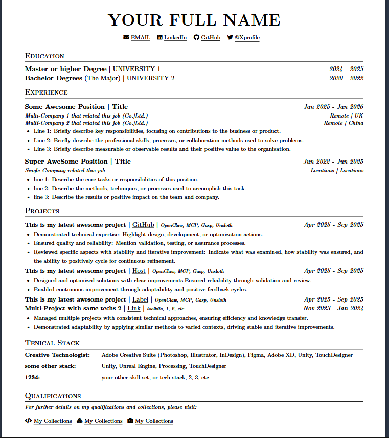
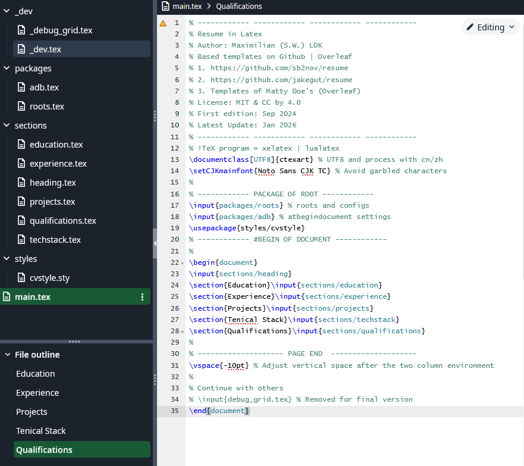

# sw-single-page-cv

單頁 CV / 履歷的 LaTeX 模板。  
LaTeX templates for single-page CV and resume documents.

---

## 概述 | Overview

專業且易於自訂的 LaTeX 單頁 CV 模板。此範本把內容結構化為獨立段落，方便替換與重排。  
A professional and easily customizable single-page CV LaTeX template. Sections are modular for easy editing and reordering.

---

## 預覽 | Preview




---

## 類別與狀態 | Category and Lifecycle

- **類別 | Category**： Other
- **類型 | Type**： LaTeX | Utilities | Templates
- **生命週期 | Lifecycle**： stable
- **標籤 | Tags**： latex, cv, resume, template

---

## 專案結構 | Project Structure

```text
single-page-cv/
├── _dev/           # 開發/範例檔案 | development/example files
├── packages/       # 自訂 LaTeX 套件 | LaTeX package fragments
├── sections/       # 各段落 (.tex) 可直接編輯 | CV sections
├── styles/         # 自訂樣式檔 (.sty)
├── main.tex        # 主要編譯入口 | main document
└── README.md       # 本檔案 | this file
```

---

## 快速上手 | Quick Start

先決條件： 已安裝 LaTeX 發行版（TeX Live、MiKTeX 或類似）。  
Prerequisites: Ensure a LaTeX distribution is installed (TeX Live, MiKTeX, or similar).

推薦編譯（使用 `latexmk`，會自動處理多次編譯與索引）：   
Recommended build (using `latexmk`, which handles multiple runs and dependencies):

```bash
latexmk -pdf main.tex
```

或使用傳統的 `pdflatex`：   
Or using the traditional `pdflatex` workflow:

```bash
pdflatex main.tex
pdflatex main.tex
```

也可將整個專案上傳到 Overleaf 並以 `main.tex` 作為編譯入口。  
You can also upload the project to Overleaf and set `main.tex` as the compilation entry.

---

## 自訂指南 | Customization

- 編輯 `sections/` 裡的各段落（例如 `heading.tex`, `experience.tex` 等）來修改內容。  
- Edit the section files in `sections/` (for example `heading.tex`, `experience.tex`) to change content.
- 在 `packages/` 或 `styles/` 中調整樣式與版面設定。  
- Adjust styling and layout in `packages/` or `styles/`.
- 若要新增欄位或結構，請在 `main.tex` 中插入或重新排列 `\\input{}` 呼叫。  
- To add fields or change structure, insert or reorder `\\input{}` calls in `main.tex`.

---

## 相依項目 | Dependencies

- LaTeX 發行版（TeX Live、MiKTeX 或相容工具）。  
- A LaTeX distribution (TeX Live, MiKTeX, or similar).
- 一些外部套件可能需要從 CTAN 或你的發行版安裝（大多數常見套件已在 `packages/` 中提供）。  
- Some external packages may need to be installed from CTAN or via your distribution (most common packages are provided in `packages/`).

---

## 輸出 | Output

範本會生成單頁 PDF 履歷，預設為適合列印與線上投遞的格式。  
The template generates a single-page PDF resume, formatted for print and online delivery by default.

---

## 貢獻與回報問題 | Contributing & Issues

- 若要回報問題或提出改進建議，請在 repository 中開 issue。歡迎 fork 並提交 pull request。  
- To report issues or propose improvements, please open an issue in the repository. Forks and pull requests are welcome.

---

## 相關連結 | Related Links

- [Repository 根目錄 | Repository Root](../../README.md)

---

授權： 請參閱儲存庫根目錄的 LICENSE。  
License: See the LICENSE file at the repository root.


